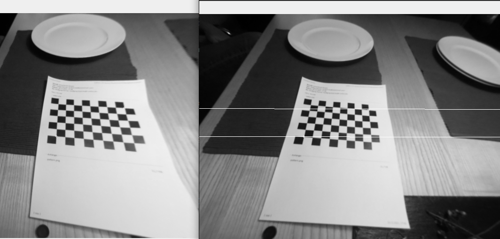

# Stereo Fisheye Calibration

Calibrate fisheye stereo rig on raspberry pi (stereopi v2). The tool will create .yaml files as used by the ROS2 stereo_image_proc. In contrast to the live calibration tool of ROS2 image_pipeline package here the calibration can be live as well as online. Also it contains a workaround to the opencv crashes when some "bad" images are in the dataset by attemptingto calibrate after each new frame before adding it to the set (--iterative).

Thanks to the [stereopi tutorial](https://github.com/realizator/stereopi-fisheye-robot/blob/master/4_calibration_fisheye.py) as well as [ROS2 Image Pipeline](https://github.com/ros-perception/image_pipeline/tree/noetic/camera_calibration/src/camera_calibration)

## Build
```
./build.sh
```

## Run
```
./run.sh -h
usage: main.py [-h] [--source_left SOURCE_LEFT] [--source_right SOURCE_RIGHT] [--iterative] [--max_frames MAX_FRAMES]

options:
  -h, --help            show this help message and exit
  --source_left SOURCE_LEFT
                        Select video device to directly fetch images from camera or folder to load pre recorded images.In case of live calibration images are stored within ./calibration_images. Otherwise source should contain glob expression a la "calibration_images/left*.png".
  --source_right SOURCE_RIGHT
                        Select "live" to directly fetch images from camera or folder to load pre recorded images.In case of live calibration images are stored within ./calibration_images. Otherwise source should contain glob expression a la "calibration_images/left*.png".
  --iterative           If set attempt to calibrate after each frame to make sure images are useful.
  --max_frames MAX_FRAMES
                        Choose how many frames should be used for calibration
```


### Live Calibration
```
./run.sh --source_left /dev/video0 --source_right /dev/video1 --iterative --max_frames 50
```
### Offline Calibration
```
./run.sh --source_left "./calibration_images/left*.png" --source_right "./calibration_images/right*.png" --max_frames 50
```

### Verify Calibration

With correct calibration matching corners should be close to epipolar line:


